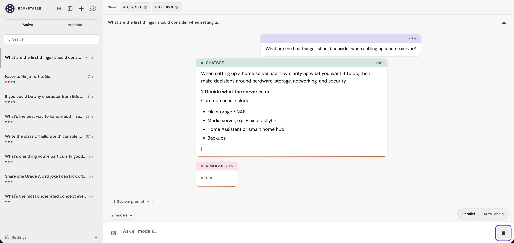
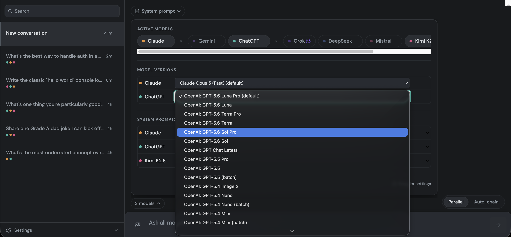
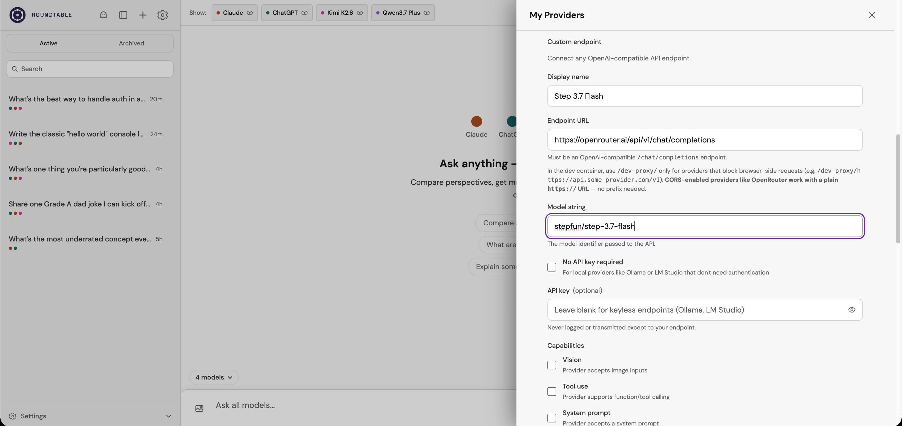
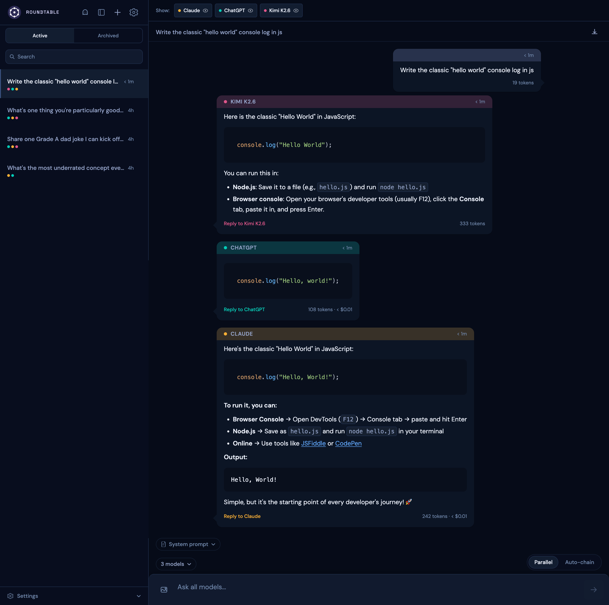
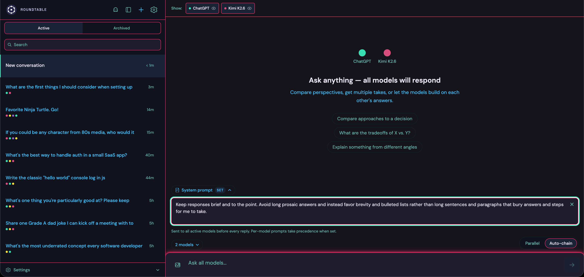

# Roundtable

Talk with multiple AI models simultaneously in a shared chat thread — compare responses, chain models together, and direct follow-ups to exactly who you want.


## Try it now

**[→ Open Roundtable](https://jacobgiordano.github.io/roundtable)** — runs in your browser, nothing to install.

Built-in providers (Claude, GPT, Gemini, etc.) can't be called directly from a browser page due to a browser security rule called CORS. The fix is a small free Cloudflare Workers proxy — setup takes about 2 minutes and uses Cloudflare's free tier. See the [deployment guide](docs/deployment.md) to get started.

**No proxy needed** if you're using an OpenAI-compatible endpoint (Ollama, OpenRouter, or a local model) — those handle CORS themselves and can be added directly in settings.

## Conversation modes


**Parallel broadcast** sends your message to every active model at once. Each responds independently — you see the same question answered from three different angles, side by side.

**Auto-chain** lets models build on each other. Responses go out in sequence; each model sees what the others said before it answers. Order shuffles each pass so no model always goes last. Use it when you want synthesis, not just comparison.

**Directed reply** addresses a follow-up to one specific model without losing the thread. Useful when one response stands out and you want to push on it.

**Stop streaming** cancels all in-flight responses from every active model at once.



## Models and providers


Six providers are built in: **Claude** (Anthropic), **ChatGPT** (OpenAI), **Gemini** (Google), **Grok** (xAI), **Mistral**, and **DeepSeek**. Each gets a distinct accent color so you can tell them apart at a glance.

The **live version picker** lets you choose the specific API model string per provider. Model lists are fetched live from each provider's API when available, so you're never looking at a stale hardcoded list.



**Custom OpenAI-compatible endpoints** can be added directly — paste the base URL and key, run a credential test, and configure capability toggles. Works with OpenRouter, Ollama, and any local model that speaks the OpenAI API format.



## More features

**Messages**



- Markdown rendering — headings, code blocks, lists, and inline formatting in all responses
- Image attachments and vision — attach via clip button, drag-and-drop, or paste; warning shown when addressing a non-vision provider
- Image generation — GPT supports it via `gpt-image-2`; Gemini via `gemini-2.5-flash-image`
- Message actions — copy, inline edit, and retry on every message bubble
- Smart scroll — auto-scroll pauses when you scroll up; resumes when you return to the bottom
- Token count — per-message usage shown in the nameplate; toggle visibility in settings

**Conversations**
- Session persistence — conversations saved to localStorage; exportable as Markdown or HTML (images optional)
- Conversation management — search/filter, rename, per-model visibility toggle, sidebar grouping
- System prompts — set a per-conversation system prompt applied to all active models; persisted with the conversation



- Ghost mode — browse and export past sessions without writing new history

**UI and themes**
- Seven built-in themes — 2 light (Chalk, Linen) and 5 dark (Ash, Ember, Midnight, Outrun, Slate)
- Custom theme import — bring your own theme via JSON (must pass the full token schema)
- Mobile-responsive layout — collapsible sidebar drawer with proper touch targets
- Onboarding — guided first-run flow when no providers are configured

**Transfer your setup**

Move your provider configuration to a new device without re-entering every setting from scratch. The Transfer Setup section is visible in the provider settings screenshot above.

What transfers: which providers are configured, model selection, custom endpoints, capability toggles, and accent color.

What does not transfer: **API keys are never included in the export** — by design, not oversight. You re-enter keys on the new device.

To transfer your setup:

1. Open Settings (gear icon) and scroll to **Transfer setup** near the bottom of the provider panel.
2. Click **Export setup** — downloads `roundtable-setup-YYYY-MM-DD.json`.
3. On the new device, open Roundtable → Settings → **Transfer setup** → **Import setup** → select the file.
4. Re-enter your API keys on the new device. Keys were not exported, so this step is required.

**Privacy**
- Client-side first — API keys stay in your browser; never logged, never exported, never transmitted except directly to each provider's official API endpoint

## How to run it

**Most users:** [use the hosted version](#try-it-now) above.

| | Hosted | Self-hosted backend | Local dev |
|---|---|---|---|
| Setup | ~2 min (proxy) | `docker compose up` | `npm install` |
| Best for | Most users | Teams, privacy-first | Contributing |
| Conversations stored | Browser localStorage | Your server (SQLite) | Browser localStorage |

### Self-hosted backend

A standalone Express + SQLite backend is included in `/backend/` for teams or individuals who want server-side session storage instead of localStorage.

```bash
cd backend
npm install
npm run dev
```

A pre-built image is published to `ghcr.io/jacobgiordano/roundtable` on GitHub Container Registry (`:latest` and version tags). The frontend is a static build with no container image.

See [`/backend/README.md`](backend/README.md) for full setup, Docker Compose instructions, and environment variables.

If you want to use the GitHub Pages–hosted frontend with a self-hosted backend, see the [deployment guide](docs/deployment.md).

### Local development

Requirements: Node 20+

```bash
npm install
npm run dev
```

Open `http://localhost:5173`. Add at least one API key in Settings and start a conversation.

### Dev container (VS Code)

For contributors using VS Code Dev Containers:

Prerequisites: [Docker Desktop](https://www.docker.com/products/docker-desktop/) and [VS Code](https://code.visualstudio.com/) with the [Dev Containers extension](https://marketplace.visualstudio.com/items?itemName=ms-vscode-remote.remote-containers).

1. Clone the repository and open it in VS Code.
2. When prompted, click **Reopen in Container** (or run `Dev Containers: Reopen in Container` from the command palette).
3. Wait for the container to build. The firewall initializes automatically and restricts outbound traffic to approved API endpoints only.
4. Open a terminal inside VS Code and run `npm run dev`.
5. Open `http://localhost:5173`.

> **Note — OpenAI connection failures mid-session:** The dev container firewall resolves `api.openai.com` to a set of IPs at container start time. OpenAI's CDN can rotate those IPs during a long session, causing intermittent network errors. Restart the container to re-resolve. No code change needed.

## Development

```bash
npm run dev        # start dev server (http://localhost:5173)
npm run build      # type-check + production build
npm run lint       # ESLint (zero warnings policy)
npm test           # Vitest watch mode
npm run test:run   # Vitest single run
npm run test:e2e   # Playwright end-to-end tests
npm run typecheck  # tsc --noEmit
```

## Documentation

- [Deployment guide](docs/deployment.md) — proxy setup and self-hosted backend
- [Provider reference](docs/providers.md) — API key sources, storage, and provider status
- [Custom themes](docs/themes.md) — theme token schema and import guide

## Contributing

See [CONTRIBUTING.md](CONTRIBUTING.md) for the agent-based development model, directory ownership rules, and how to submit changes.

## License

[PolyForm Noncommercial 1.0.0](LICENSE) — free for non-commercial use. Commercial use prohibited.
